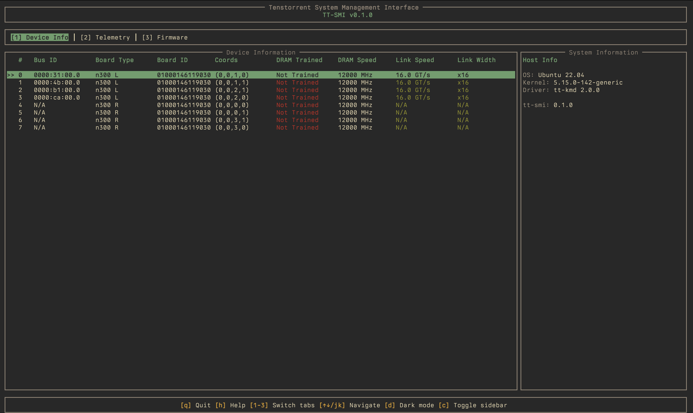
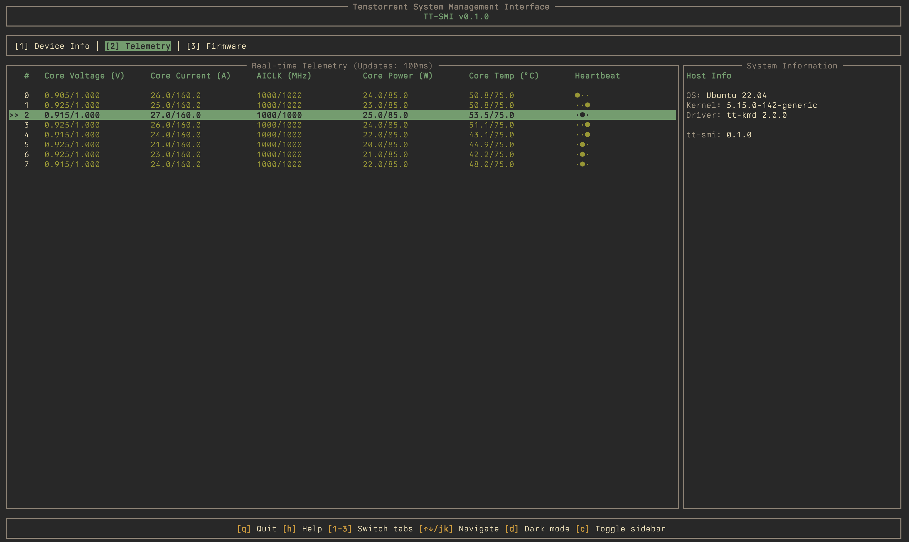
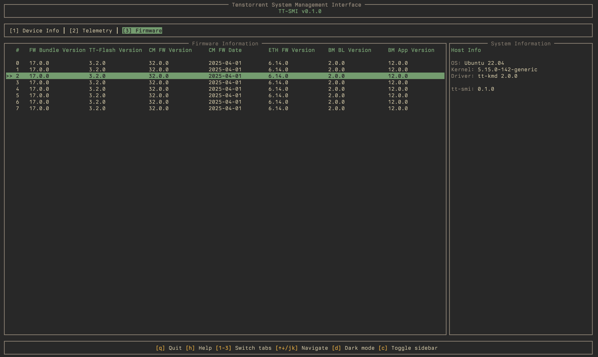

# tt-smi-rs

A rewrite of [tt-smi](https://github.com/tenstorrent/tt-smi) in Rust & Ratatui based on [luwen](https://github.com/tenstorrent/luwen). Prettier, faster!

## Features

- Feature parity with [tt-smi](https://github.com/tenstorrent/tt-smi/tree/main)






```bash
>tt-smi-rs --help
Usage: tt-smi-rs [OPTIONS] [COMMAND]

Commands:
  list                   List all available Tenstorrent devices [aliases: ls]
  snapshot               Export a snapshot of device information as JSON [aliases: s]
  reset                  Reset device(s) by PCI index or config file [aliases: r]
  generate-reset-config  Generate reset configuration file [aliases: g]
  glx-reset              Galaxy reset mode (reset all ASICs on galaxy host)
  query                  Query specific device fields [aliases: q]
  help                   Print this message or the help of the given subcommand(s)

Options:
  -v, --verbose
          Enable verbose logging

  -c, --compact
          Compact mode (hide sidebar)

  -l, --local
          Run on local chips only (Wormhole only)

  -h, --help
          Print help (see a summary with '-h')

  -V, --version
          Print version
```

## Installation

```bash
cargo build --release
```

## Usage

### Interactive TUI Mode (default)
```bash
tt-smi
```

### Command Line Options
```bash
# List all devices
tt-smi list

# Export snapshot as JSON
tt-smi snapshot -o snapshot.json

# Reset a device
tt-smi reset <device>

# Generate reset config
tt-smi generate-reset-config
```

## Keyboard Shortcuts

| Key | Action |
|-----|--------|
| `q` | Quit |
| `h` | Help |
| `1` | Device Info tab |
| `2` | Telemetry tab |
| `3` | Firmware tab |
| `↑`/`k` | Previous device |
| `↓`/`j` | Next device |
| `d` | Toggle dark mode |
| `c` | Toggle sidebar |

